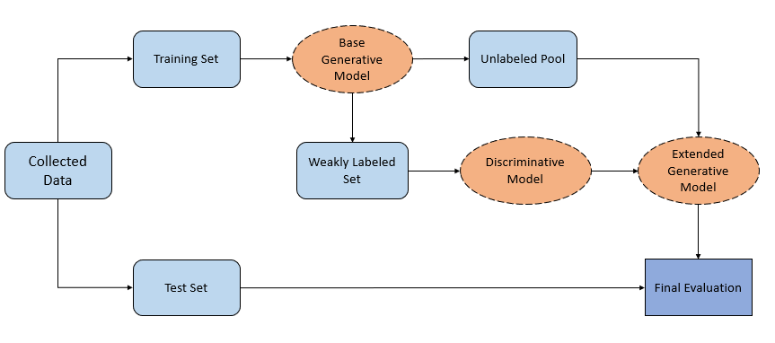
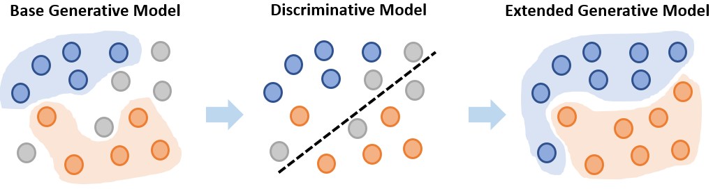

# Predicting the Demographics of Twitter Users with Programmatic Weak Supervision 

## Introduction 

This repository contains the code implementation of the paper "Predicting the Demographics of Twitter Users with Programmatic Weak Supervision",published in Transactions in Operations Research (TOP).
The paper proposes 3-step Programmatic Weak Supervision (3-step PWS), a new demographic inference model to predict the gender, age category, and location of Twitter users without human labeling effort.  

We conducted experiments on the Belgian (Flemish) Twitter population and reached an accuracy of 91.6% for gender (Male-Female), 55.5% for age category, and 73.8% for location at the Belgian province level, respectively.

<p align="center">
  
</p>

3-step PWS is illustrated on the figure below. Firstly, a set of weak labeling functions (LFs) - heuristics, knowledge bases, third-party models and few-shot learners - is defined and their predictions are combined in a generative model to create a weakly labeled set of observations. Secondly, a discrimative model is trained on the weak labels. Eventually, the noisy discriminative model is incorporated as a labeling function. The resulting extended generative model returns the final demographic labels for all observations.

<p align="center">
  
</p>

## Installation guide

Experiments were runned with Python 3.9. Required dependency packages are listed in *requirements.txt*. We recommend to create a new environment to avoid conflicts. 

```
$ conda create --name DemographicsPWS python=3.9
$ conda activate DemographicsPWS
$ pip install -r requirements.txt
```

CLIP is required and can be installed as follows on a CUDA GPU machine. For CPU machines replace *cudatoolkit=11.0* by *cpuonly*. Ignore the first command if you already have git installed.
```
$ conda install git
$ conda install --yes -c pytorch pytorch=1.7.1 torchvision cudatoolkit=11.0 
$ pip install ftfy regex tqdm
$ pip install git+https://github.com/openai/CLIP.git
```
For more details on CLIP installation, please see
the CLIP [repo](https://github.com/openai/CLIP).

## How to use

Here is an illustration of how 3-step PWS can be used to predict the gender of Twitter users.

```python

import pandas as pd
from utils.datasplitter import active_mentioned_users_split
from preprocessing.feature_engineering import create_feature_matrix
from demographic_inference.labeling_functions import *
from demographic_inference.models import GenerativeModel, DiscriminativeModel

#Load data
user = pd.read_csv('data/user_df.csv')
tweet = pd.read_csv('data/tweet_df.csv')
#Keep active users only
active, mentioned = active_mentioned_users_split(user,tweet)
#Prepare the feature matrix. Available features : bow, metadata, celebrity, topic
#Topic : available if the dataset contains more than 100 users
#Celebrity : requires  a bearer token to collect the followers ids
feature_matrix = create_feature_matrix(tweet,active,
                                       mentioned_user_df=mentioned, 
                                       features=['bow','metadata']) 

#Base Generative Model
lfs_gender = [male_first_name, female_first_name, 
              male_keywords, female_keywords,
              gender_deepface, CLIP_lf
             ] 
gender_gen = GenerativeModel(cardinality=2, lfs=lfs_gender)
L_gender = gender_gen.apply_lfs(active)
gender_gen.fit(L_gender)
weak_labels = gender_gen.predict(L_gender)

#Discriminative Model 
feature_matrix['weak_label'] = weak_labels
gender_labeled = feature_matrix[feature_matrix.weak_label!=-1]
#Create a Discriminative Model, by default a logistic regression classifier
gender_disc = DiscriminativeModel() 
#Fit the model on the weakly labeled users
gender_disc.fit(gender_labeled.drop(columns=['user_id','weak_label']),gender_labeled['weak_label'])
#Make predictions for both weakly labeled and unlabeled users
disc_predictions = gender_disc.predict(feature_matrix.drop(columns=['user_id','weak_label']))

#Extended Generative Model
L_gender_extended = gender_gen.extend(L_gender,disc_predictions)
gender_gen.fit(L_gender_extended)
final_labels = gender_gen.predict(L_gender_extended)
```

## Data Collection

For privacy reasons, the Twitter data collected for the  paper's experiments cannot be shared online. We provide instead a small toy dataset with fictional accounts to test the functionalities of 3-step PWS. 

The following code snippet allows you to collect your own dataset. For this you will need your own bearer token provided by [Twitter](https://developer.twitter.com/en/products/twitter-api/academic-research). 
The number of tweet to retrieve per time period is defined by *tweet_per_period*. The periods are delimited by the start_list and end_list parameters, they need to be valid timestamps.  The keyword parameter accepts any Twitter Full-Archive Search query.

```python

from utils.data_collection import DataLoader

bearer_token = " " 
dl = DataLoader(bearer_token)   #Insert your bearer token here

#Retrieve around 200 tweets, 100 on 2022/01/01 and 100 on 2022/01/02, written in English
tweet_list = dl.retrieve_tweet(start_list=['2022-01-01T00:00:00.000Z','2022-01-02T00:00:00.000Z'],
                               end_list=['2022-01-02T00:00:00.000Z','2022-01-03T00:00:00.000Z'],
                               keyword="lang:en",
                               tweet_per_period=100
                               )
                               
#Convert the Twitter json output to csv  and save files                             
tweet, user = dl.to_dataframe(tweet_list)
tweet.to_csv('output_path')
user.to_csv('output_path')

```


## Define your own demographic Inference Task

The current model supports  gender, age, and location (Flemish provinces) prediction. Available heuristic labeling function resources represent Belgium, and to a lower extent the Netherlands. 

To define additional demographic categories, add new demographic attributes, or change the geographic area of interest, you should do the following :

1. Add the new demographic categories to *utils/mapping.py*. If necessary, remove existing demographic categories. For example :
```python
#Defining new age categories in mapping.py 
#Existing categories
MINOR = 0
TWENTIES = 1 
THIRTIES = 2 
#FOURTIESABOVE = 3  --> remove
#New categories
FOURTIES = 3
FIFTIES = 4 
SIXTIESABOVE = 5
```
2. Replace existing resources in *data/resources* by new ones. For example, replace the belgian city names in *city_names.csv* by another file with the city names of your geographic area of interest.
3. Define new labeling functions in *demographic_inference/labeling_functions.py*. Templates are available for keywords, names, and CLIP-based labeling functions. For RegEx labeling functions, you can define your own by using the following syntax, where TARGET should be replaced by the desired category:
```python
@labeling_function()
def some_regex_lf(row):
  return TARGET if re.search(r"insert here the regular expression", row['description']) else ABSTAIN
```


## Citation

Please cite our paper if you use this code in your projects : 

```
@article{tonglet2024predicting,
  title={Predicting the demographics of Twitter users with programmatic weak supervision},
  author={Tonglet, Jonathan and Jehoul, Astrid and Reusens, Manon and Reusens, Michael and Baesens, Bart},
  journal={TOP},
  pages={1--37},
  year={2024},
  publisher={Springer},
  doi={https://doi.org/10.1007/s11750-024-00666-y}
}
```


## Contact
Jonathan Tonglet jonathan.tonglet@gmail.com ;
Astrid Jehoul    as.jehoul@gmail.com 
